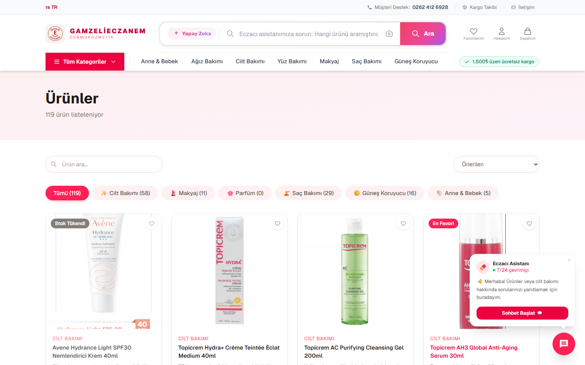
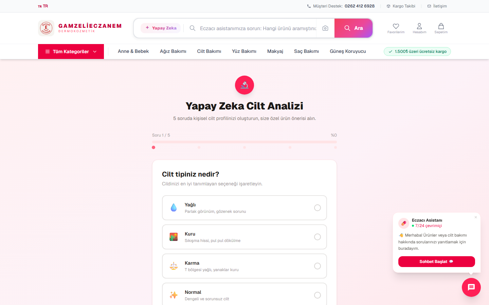
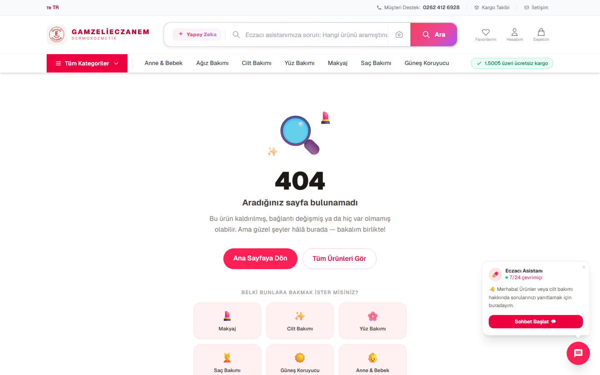
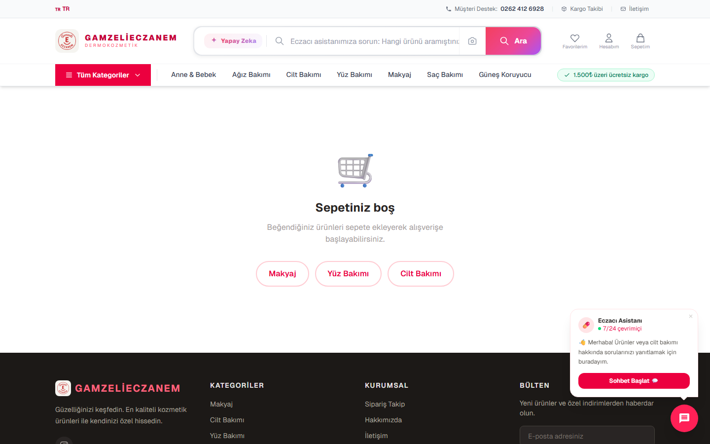
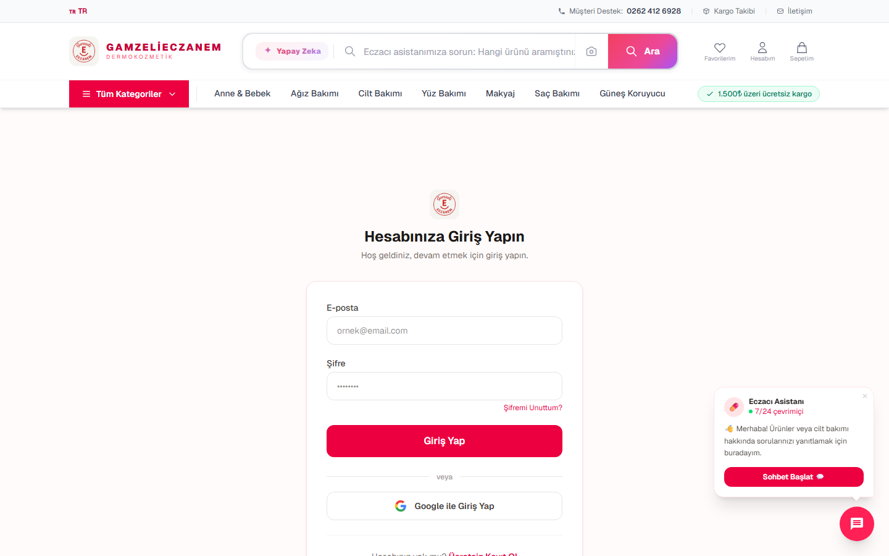
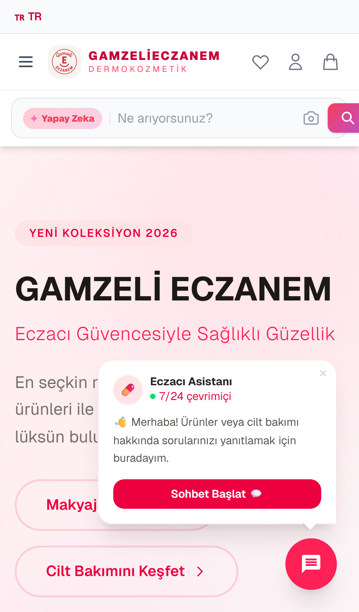
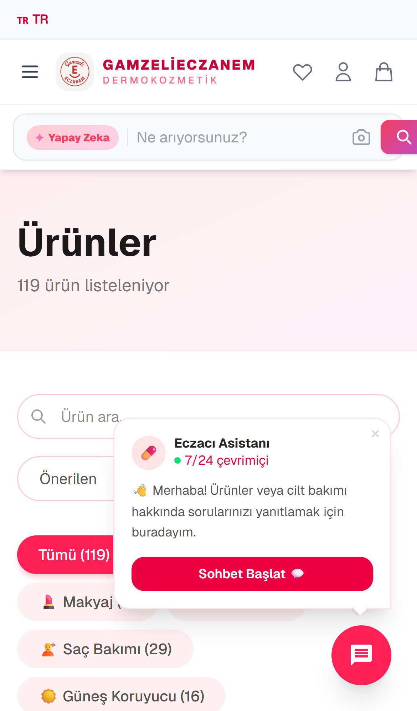

<h1 align="center">💊 Gamzelieczanem</h1>

<p align="center">
  <strong>🤖 Yapay zekâ destekli kozmetik ve kişisel bakım e-ticaret platformu</strong>
  <br/>
  <sub>Eczacı güvencesiyle · AI cilt analizi · Sanal makyaj deneme · 7/24 Eczacı Asistanı</sub>
</p>

<p align="center">
  <a href="https://gamzeli-eczanem-shop.vercel.app">
    
  </a>
  <a href="https://gamzeli-eczanem-shop.vercel.app">
    
  </a>
</p>

<p align="center">
  
  
  
  
  
  
</p>

<p align="center">
  
</p>

---

## ✨ Öne Çıkan Özellikler

- 🤖 **AI Cilt Analizi** — Anket tabanlı kişiselleştirilmiş ürün önerileri (Anthropic Claude)
- 💄 **Sanal Makyaj Deneme** — face-api.js ile gerçek zamanlı ruj, allık ve far simülasyonu
- 💳 **Güvenli Ödeme** — Iyzico entegrasyonu ile kredi/banka kartı
- 👤 **Kullanıcı Hesabı** — E-posta + Google OAuth, sipariş geçmişi, favoriler
- 🛒 **Tam E-Ticaret** — Sepet, indirim kodları, sipariş takibi, stok yönetimi
- 📧 **Bildirimler** — Email (SMTP) ve SMS (Netgsm) ile sipariş bildirimleri
- 🔐 **Admin Paneli** — Ürün, sipariş ve kullanıcı yönetimi
- 🧠 **7/24 Eczacı Asistanı** — AI destekli ürün önerisi sohbeti

---

## 📸 Ekran Görüntüleri

<table>
  <tr>
    <td width="50%"><strong>Anasayfa</strong><br/></td>
    <td width="50%"><strong>Ürünler</strong><br/></td>
  </tr>
  <tr>
    <td width="50%"><strong>AI Cilt Analizi</strong><br/></td>
    <td width="50%"><strong>Sanal Makyaj Deneme</strong><br/></td>
  </tr>
  <tr>
    <td width="50%"><strong>Sepet</strong><br/></td>
    <td width="50%"><strong>Giriş / Hesap</strong><br/></td>
  </tr>
</table>

### 📱 Mobil Görünüm

<p align="center">
  
  &nbsp;&nbsp;
  
</p>

---

## 🛠️ Teknoloji

| Katman | Teknoloji |
|--------|-----------|
| Frontend | Next.js 16 · React 19 · Tailwind CSS · Framer Motion |
| Backend | Next.js API Routes · NextAuth |
| Veritabanı | Supabase (PostgreSQL) |
| Ödeme | Iyzico |
| AI | Anthropic Claude SDK · face-api.js |
| E-posta & SMS | SMTP · Netgsm |
| Deploy | Vercel (cron jobs: terk-sepet, rutin-hatirlatici) |

---

## 📁 Proje Yapısı

```
src/app/
├── (shop)/                   # Mağaza sayfaları
│   ├── urunler/              # Ürün listesi & detay
│   ├── cilt-analizi/         # AI cilt analizi
│   ├── sanal-deneme/         # Sanal makyaj deneme
│   ├── sepet/                # Alışveriş sepeti
│   └── hesabim/              # Kullanıcı hesabı
├── admin/                    # Admin paneli
├── api/                      # API route handlers
│   ├── odeme/                # Iyzico callback & checkout
│   ├── terk-sepet/           # Terk edilmiş sepet cron
│   └── rutin-hatirlatici/    # Rutin hatırlatma cron
└── odeme/                    # Ödeme sayfaları
```

---

## 🚀 Yerel Kurulum

```bash
git clone https://github.com/Atalaydurmaz/GamzeliEczanem-.git
cd GamzeliEczanem-
npm install
cp .env.example .env.local
npm run dev
```

Tarayıcıda [http://localhost:3000](http://localhost:3000) adresini aç.

### ⚙️ Ortam Değişkenleri

```env
# Supabase
NEXT_PUBLIC_SUPABASE_URL=
NEXT_PUBLIC_SUPABASE_ANON_KEY=
SUPABASE_SERVICE_ROLE_KEY=

# NextAuth
NEXTAUTH_SECRET=
NEXTAUTH_URL=

# Google OAuth
GOOGLE_CLIENT_ID=
GOOGLE_CLIENT_SECRET=

# Iyzico
IYZICO_API_KEY=
IYZICO_SECRET_KEY=

# Anthropic Claude (AI cilt analizi & asistan)
ANTHROPIC_API_KEY=

# Email (SMTP)
SMTP_HOST=
SMTP_USER=
SMTP_PASS=

# SMS (Netgsm)
NETGSM_USER=
NETGSM_PASSWORD=
```

---

## 📦 Kategoriler

| Kategori | Açıklama |
|----------|----------|
| Cilt Bakım | Temizleyici, nemlendirici, serum |
| Makyaj | Ruj, fondöten, maskara |
| Güneş Koruyucu | SPF ürünleri |
| Saç Bakımı | Şampuan, saç maskesi |
| Ağız Bakımı | Diş macunu, gargara |
| Anne & Bebek | Bebek şampuanı, krem |

---

<p align="center">
  <sub>Geliştirici: <a href="https://github.com/Atalaydurmaz">@Atalaydurmaz</a></sub>
</p>
